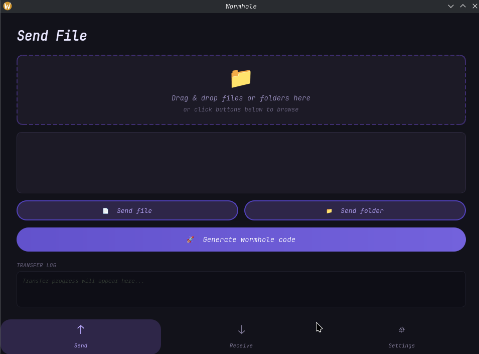
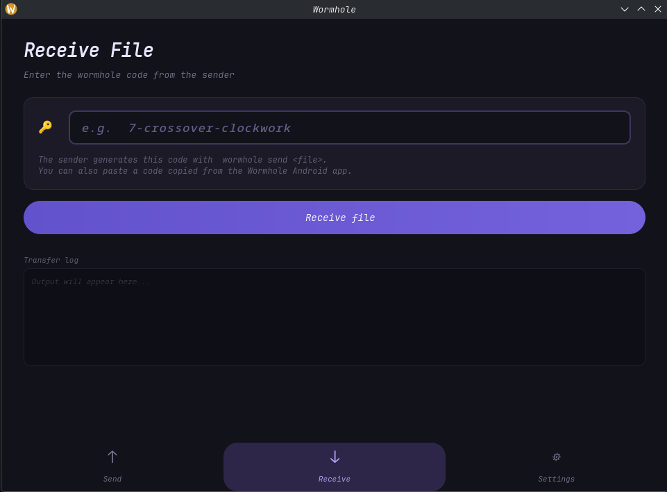
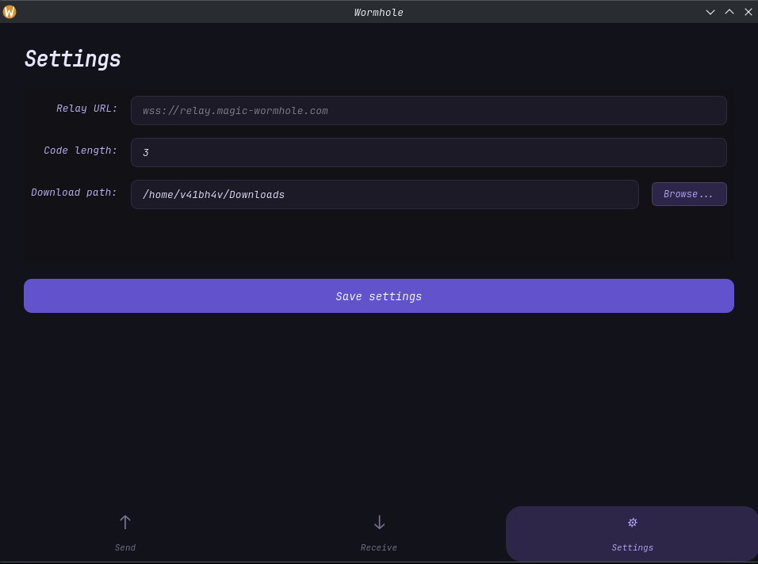

# 🪄 Wormhole Qt

<div align="center">

A beautiful desktop GUI client for [Magic Wormhole](https://github.com/magic-wormhole/magic-wormhole) built with Qt6 and C++.

[](https://www.gnu.org/licenses/gpl-3.0)
[](https://www.qt.io/)
[](https://isocpp.org/)
[]()


</div>

---

> **🤖 AI-Assisted Development Note**  
> This project was developed with significant assistance from AI tools (**Claude** by Anthropic and **DeepSeek**) to accelerate development and learn Qt6/C++ programming patterns. The development process was a collaboration between human direction and AI implementation.

---

## ✨ Features

| Feature | Description |
|---------|-------------|
| 🚀 **Send Files & Folders** | Drag and drop onto the window or use the file picker dialog |
| 📥 **Receive Files** | Enter wormhole codes to receive files securely |
| 🎨 **Modern Dark UI** | Clean dark theme with smooth animations and transitions |
| ⚙️ **Configurable Settings** | Custom relay server URL, adjustable code length, default download path |
| 📋 **One-Click Copy** | Copy generated wormhole codes to clipboard instantly |
| 📊 **Live Progress** | Real-time transfer progress bars and status updates |
| 🔔 **Desktop Notifications** | System tray notifications for completed transfers |
| 📜 **Transfer History** | Keep track of recent transfers (optional) |

## 📸 Screenshots

<div align="center">

| Send View | Receive View | Settings |
|:---:|:---:|:---:|
|  |  |  |

</div>

## 🔧 How It Works

Wormhole Qt acts as a native GUI frontend for the official Magic Wormhole command-line tool. The application:

1. Spawns the `wormhole` CLI as a subprocess
2. Parses stdout/stderr in real-time to extract codes, progress, and status
3. Displays a clean, user-friendly interface for the underlying protocol

All file transfers remain **end-to-end encrypted** using the same PAKE (Password-Authenticated Key Exchange) security as the original Magic Wormhole.

## 📋 Prerequisites

### Required
- **Qt6** development libraries (Core, Widgets, Network, Concurrent)
- **CMake** (≥ 3.16)
- **C++ compiler** with C++17 support
- **Magic Wormhole** CLI (Python package)

### Installing Magic Wormhole

```bash
# Recommended: Install via pipx (isolated environment)
pipx install magic-wormhole

# Alternative: Install via pip
pip install magic-wormhole

# Verify installation
wormhole --version
